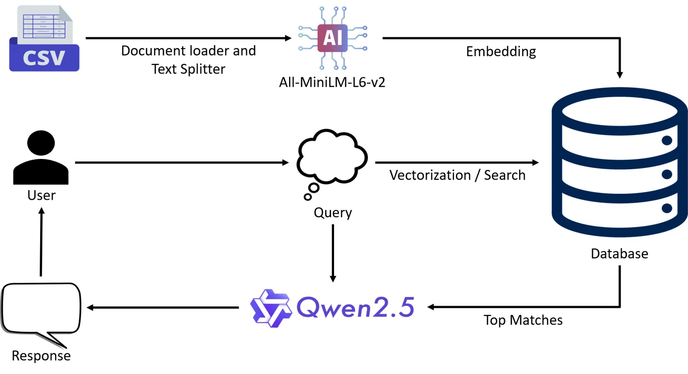

# AssetShield-LLM: Risk Based Cybersecurity Advisor

A local, privacy-first cybersecurity advisory tool powered by a Retrieval-Augmented Generation (RAG) pipeline. Built for small businesses that need actionable cybersecurity guidance without the cost or complexity of enterprise consulting.

---

## Overview

AssetShield-LLM uses a locally-run large language model (Qwen2.5-3B) combined with a curated knowledge base of industry-standard cybersecurity frameworks to answer questions about risks, controls, threats, and mitigations. All processing happens on your machine — no data leaves your environment.

The system was designed with non-technical users in mind. Small business owners and operators can ask plain-language questions and receive grounded, framework-backed guidance.

---

## Architecture

The pipeline works in two phases:

**Ingestion**
1. Cybersecurity framework data is loaded from CSV files
2. A document loader and text splitter chunks the data into manageable segments
3. Chunks are embedded using `all-MiniLM-L6-v2` and stored in a local vector database

**Query**
1. The user submits a question through the Gradio interface
2. The query is vectorized and used to search the database for the most relevant chunks
3. The top matches are passed as context to Qwen2.5-3B
4. The model generates a response and returns it to the user

---

## Knowledge Base

The vector database is built from the following cybersecurity frameworks:

| Source | Description |
|---|---|
| **NIST SP 800-53** | Security and privacy controls for federal and organizational systems |
| **MITRE ATT&CK** | Adversary tactics, techniques, and procedures (TTPs) |
| **MITRE D3FEND** | Defensive countermeasures mapped to offensive techniques |
| **CISA KEV** | Known Exploited Vulnerabilities catalog maintained by CISA |

---

## Tech Stack

| Component | Technology |
|---|---|
| Language | Python |
| LLM | Qwen2.5-3B (local) |
| Embeddings | all-MiniLM-L6-v2 |
| UI | Gradio |

---

## Getting Started

The full project is built and runs as a Kaggle notebook. No local setup required.

**[Open in Kaggle](https://www.kaggle.com/code/colepaulik/assetshield-llm)**

To run it yourself:
1. Open the notebook in Kaggle
2. Click **Copy & Edit** to fork it to your own account
3. Enable GPU acceleration under **Session options** (recommended for Qwen2.5-3B)
4. Run all cells in order

---

## Use Cases

- "What controls should I have in place to protect customer data?"
- "What are the most commonly exploited vulnerabilities I should patch first?"
- "How do I defend against phishing attacks targeting small businesses?"
- "What does NIST recommend for access control in a small office environment?"

---

## Academic Context

This project was developed as a capstone for a B.S. in Cybersecurity at the University of Idaho. The goal was to make enterprise-grade cybersecurity frameworks accessible to small businesses through a locally-run, privacy-preserving AI advisory tool.

---

## License

This project is for educational and non-commercial use. Referenced frameworks (NIST, MITRE ATT&CK, MITRE D3FEND, CISA KEV) are publicly available and used in accordance with their respective terms.
